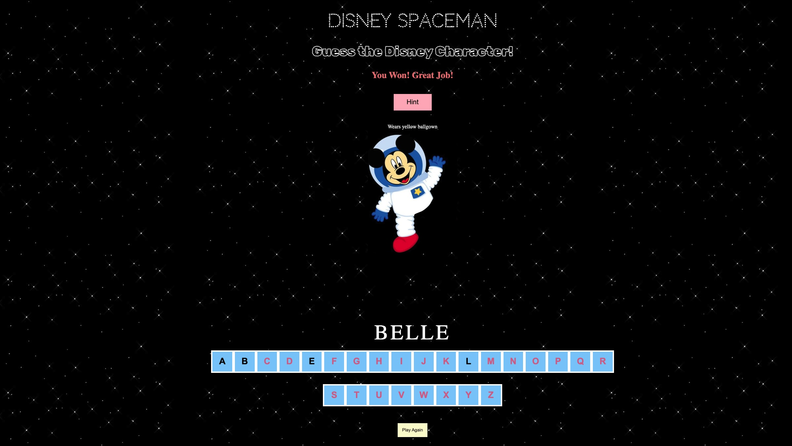

# :memo: Disney Spaceman 

Let's play a game called Disney Spaceman! Spaceman is exploring the magical world of Disney. We must assist Spaceman with identifying the Disney characters along the way.

Here's how it works: In each round, you'll be given the name of a secret Disney character, but the catch is, the name will be displayed with dashes instead of letters. Your job is to guess the letters one by one to reveal the character's name. But be cautious! Each wrong guess will cost you a life, and you only have six lives for each game. The Spaceman image (a.k.a Mickey) loses a body part for each wrong guess. As you guess correctly, the letters will appear in their designated spots, slowly uncovering the character's name. To win, simply guess all of the letters in the secret word before six incorrect guesses. Feeling stuck? Don't worry, you can ask for a hint once per game to give you a little push. And if you need a fresh start, you can reset the game anytime you want.

Simply click on the letters to make your guesses and enjoy the fun of Disney Spaceman!

# :camera_flash: Screenshot

 ## :computer: Technologies Used

- JavaScript
- HTML
- CSS
- VS Code

# :fire: Getting Started

[Click to Play Spaceman!](https://vidhipatel1999.github.io/Spaceman-Game/)

- Click on letters to try and guess the secret word (a Disney Character)
- If you need help, click on the hint button to reveal a hint
- To win, guess the word correctly before making six incorrect guesses
- If you make six incorrect guesses, you lose
- Click the Play Again button to start a new game

# :next_track_button: Next Steps

- Add categories to the game so players can choose from different disney movies
- Add sound to the game (this would involve integrating specific sounds for both winning and losing messages)
- Include a timer

